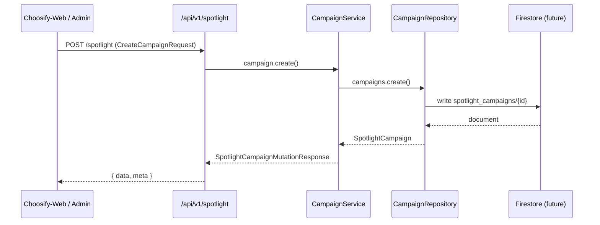
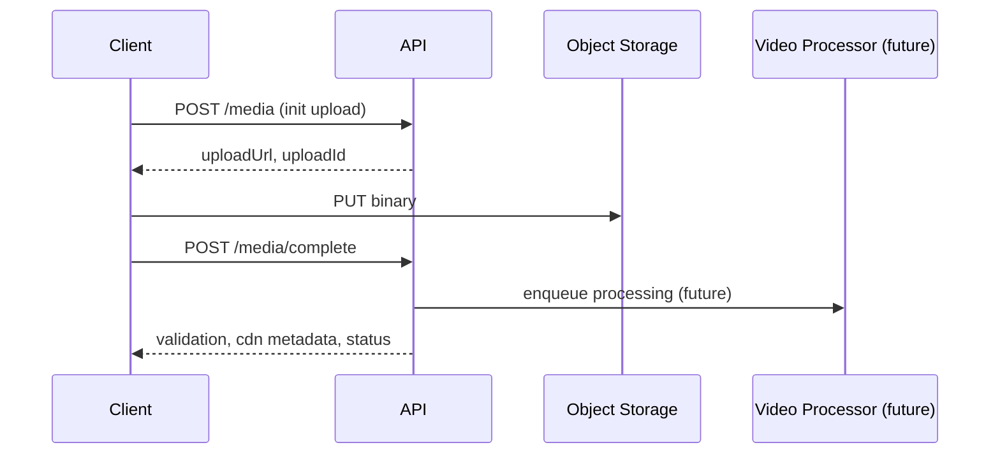

# Spotlight API Contracts

**Sprint:** LE-005.3.2 — Backend Integration Preparation  
**Status:** Contracts only — no implementation

---

## Overview

Stable request/response models shared between **Choosify-Web**, **choosify-admin-4.0**, and future API workers.

**Module:** `src/types/spotlight/api/`

---

## Base URL

```
/api/v1/spotlight
```

Route constants: `SPOTLIGHT_API_ROUTES` in `api/routes.ts`

---

## Request Flow



---

## Response Envelope

All responses use:

```typescript
interface SpotlightApiResponse<T> {
  data: T;
  meta: { requestId: string; timestamp: string; version?: string };
}
```

List responses wrap `SpotlightPaginatedResponse<T>` with `items`, `nextCursor`, `totalEstimate`.

Errors use `SpotlightApiErrorResponse` — see Error Model below.

---

## Campaign Endpoints

| Method | Route | Request | Response |
|--------|-------|---------|----------|
| POST | `/spotlight` | `SpotlightCreateCampaignRequest` | `SpotlightCampaignMutationResponse` |
| PATCH | `/spotlight/:id` | `SpotlightUpdateCampaignRequest` | `SpotlightCampaignMutationResponse` |
| DELETE | `/spotlight/:id` | `SpotlightDeleteCampaignRequest` | `void` |
| POST | `/spotlight/:id/duplicate` | `SpotlightDuplicateCampaignRequest` | `SpotlightCampaignMutationResponse` |
| POST | `/spotlight/:id/submit` | `SpotlightWorkflowActionRequest` | `SpotlightCampaignMutationResponse` |
| POST | `/spotlight/:id/approve` | `SpotlightWorkflowActionRequest` | `SpotlightCampaignMutationResponse` |
| POST | `/spotlight/:id/reject` | `SpotlightWorkflowActionRequest` | `SpotlightCampaignMutationResponse` |
| POST | `/spotlight/:id/archive` | `SpotlightWorkflowActionRequest` | `SpotlightCampaignMutationResponse` |
| POST | `/spotlight/:id/restore` | `SpotlightWorkflowActionRequest` | `SpotlightCampaignMutationResponse` |
| POST | `/spotlight/:id/publish` | `SpotlightPublishCampaignRequest` | `SpotlightCampaignMutationResponse` |
| POST | `/spotlight/:id/schedule` | `SpotlightScheduleCampaignRequest` | `SpotlightCampaignMutationResponse` |
| GET | `/spotlight` | `SpotlightListCampaignsRequest` | `SpotlightCampaignListResponse` |
| GET | `/spotlight/search` | `SpotlightSearchCampaignsRequest` | `SpotlightCampaignListResponse` |
| GET | `/spotlight/:id` | — | `SpotlightCampaignDetailsResponse` |
| GET | `/spotlight/:id/preview` | `SpotlightCampaignPreviewRequest` | `SpotlightCampaignPreviewResponse` |
| GET | `/spotlight/:id/metrics` | `SpotlightCampaignMetricsRequest` | `SpotlightCampaignMetricsResponse` |
| GET | `/spotlight/:id/health` | — | `SpotlightCampaignHealthResponse` |
| GET | `/spotlight/:id/versions` | — | `SpotlightCampaignVersionsResponse` |
| GET/PATCH | `/spotlight/:id/seo` | `SpotlightUpdateSeoRequest` | `SpotlightCampaignSeoResponse` |
| GET/PATCH | `/spotlight/:id/localization` | `SpotlightUpdateLocalizationRequest` | `SpotlightCampaignLocalizationResponse` |
| GET/PATCH | `/spotlight/:id/targeting` | `SpotlightUpdateTargetingRequest` | `SpotlightCampaignTargetingResponse` |
| GET/PATCH | `/spotlight/:id/products` | `SpotlightCampaignProductsRequest` | `SpotlightCampaignProductsResponse` |
| GET/PATCH | `/spotlight/:id/media` | `SpotlightCampaignMediaRequest` | `SpotlightCampaignMediaResponse` |
| GET | `/spotlight/:id/assets` | — | `SpotlightCampaignAssetsResponse` |
| GET | `/spotlight/templates` | — | `SpotlightCampaignTemplatesResponse` |
| POST | `/spotlight/media` | `SpotlightInitUploadRequest` | `SpotlightInitUploadResponse` |

---

## Upload Flow



---

## Error Model

Domains: `validation`, `media`, `publishing`, `scheduling`, `moderation`, `permission`, `analytics`, `upload`, `version`, `localization`, `seo`

Example:

```json
{
  "error": {
    "domain": "publishing",
    "code": "SPOTLIGHT_NOT_APPROVED",
    "message": "Campaign must be approved before publishing.",
    "details": [{ "field": "status", "code": "SPOTLIGHT_NOT_APPROVED", "message": "..." }]
  },
  "meta": { "requestId": "req-abc", "timestamp": "2026-07-10T00:00:00Z" }
}
```

---

## Event Bus (CTO)

Async events: `CampaignCreated`, `CampaignPublished`, `CampaignViewed`, `CampaignClicked`, `CampaignPurchased`, etc.

See `api/events.ts` — `SpotlightEventEnvelope<T, P>`

---

## Webhooks (CTO)

External callbacks: `media.processing.complete`, `campaign.published`, `analytics.export.ready`, `ai.optimization.complete`

See `api/webhooks.ts`

---

## Shared DTO Package (CTO)

Future monorepo package: `@choosify/spotlight-types`

See `api/sharedDto.ts` for shareable vs frontend-only vs backend-only modules.

---

## Related Docs

- [SPOTLIGHT_SERVICES.md](./SPOTLIGHT_SERVICES.md)
- [SPOTLIGHT_REPOSITORIES.md](./SPOTLIGHT_REPOSITORIES.md)
- [SPOTLIGHT_INTEGRATIONS.md](./SPOTLIGHT_INTEGRATIONS.md)
