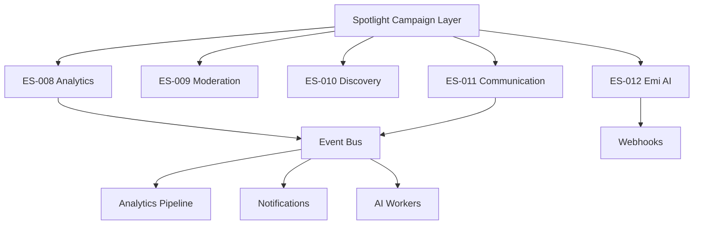
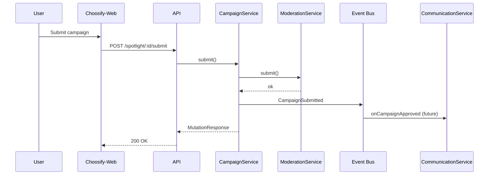

# Spotlight Integration Contracts

**Sprint:** LE-005.3.2 — ES-001 through ES-012 alignment  
**Module:** `src/types/spotlight/integrations/`

---

## Integration Map



---

## ES-008 Analytics

**Module:** `integrations/analytics.ts`

### Events

| Event | Description |
|-------|-------------|
| `campaign_impression` | Card visible |
| `campaign_view` | Detail view opened |
| `view_3s` / `view_10s` | Engagement thresholds |
| `completion` | Media completed |
| `pause` / `replay` | Playback interaction |
| `share` / `compare` / `wishlist` | Social actions |
| `product_details` / `shop_now` | CTA clicks |
| `purchase` / `campaign_conversion` / `campaign_revenue` | Conversion |

### Contract

```typescript
interface SpotlightAnalyticsServiceContract {
  track(req: SpotlightAnalyticsTrackRequest): Promise<void>;
  getCampaignMetrics(campaignId, from, to): Promise<SpotlightAnalyticsRef>;
  exportMetrics(campaignId, format): Promise<{ exportId: string }>;
}
```

---

## ES-009 Moderation

**Module:** `integrations/moderation.ts`

### Actions

Submit, Approve, Reject, Request Changes, Moderate Media/Campaign/Assets

### Extensions

- `SpotlightModerationHistoryResponse` — full audit trail
- `SpotlightFraudSignal` — fraud detection hook
- `SpotlightTrustScoreHook` — seller trust score

---

## ES-010 Discovery

**Module:** `integrations/discovery.ts`

### Surfaces

Featured, Trending, Homepage, Brand, Category, Recommendations, Search, Autocomplete, Ranking

### Contract

```typescript
interface SpotlightDiscoveryServiceContract {
  getFeatured(query): Promise<SpotlightApiListResponse<SpotlightCampaignSummary>>;
  getTrending(query): Promise<...>;
  rank(campaigns, context): Promise<SpotlightRankedCampaign[]>;
  // ...
}
```

No ranking logic implemented — interface only.

---

## ES-011 Communication

**Module:** `integrations/communication.ts`

### Notification Types

| Type | Trigger |
|------|---------|
| `campaign_approved` | Moderator approves |
| `campaign_rejected` | Moderator rejects |
| `campaign_scheduled` | Admin schedules |
| `campaign_published` | Goes live |
| `campaign_expired` | End date passed |
| `campaign_archived` | Archived |
| `campaign_reminder` | Pre-publish reminder |
| `seller_notification` / `admin_notification` | Role-based |
| `broadcast` | Mass notification |

Channels: `email`, `push`, `in_app`, `sms`

---

## ES-012 Emi AI

**Module:** `integrations/ai.ts`

### Capabilities

| Method | Output |
|--------|--------|
| `generateSummary` | Campaign summary text |
| `generateHeadline` | Headline variant |
| `generateDescription` | Body copy |
| `generateCta` | CTA label |
| `generateTags` / `generateKeywords` | Tag arrays |
| `generateSeo` | Full SEO object |
| `suggestImprovements` | Field-level suggestions |
| `calculateHealth` | Health score |
| `predictPerformance` | Performance prediction |

---

## Event Bus (CTO)

**Module:** `api/events.ts`

Standardized payloads for async processing:

```
CampaignCreated → Analytics index + Admin notification
CampaignPublished → Discovery index + Seller notification + Webhook
CampaignViewed → Analytics pipeline
CampaignPurchased → Revenue attribution + AI feedback loop
```

```typescript
interface SpotlightEventPublisher {
  publish(event: SpotlightDomainEvent): Promise<void>;
}
```

---

## Webhooks (CTO)

**Module:** `api/webhooks.ts`

| Event | Use case |
|-------|----------|
| `media.processing.complete` | CDN ready → update campaign media |
| `campaign.published` | External ad platforms |
| `campaign.expired` | Auto-archive hooks |
| `analytics.export.ready` | Download link delivery |
| `ai.optimization.complete` | Apply AI suggestions |

---

## Shared DTO Strategy (CTO)

| Category | Examples | Package |
|----------|----------|---------|
| **Shareable** | `SpotlightCampaign`, API contracts, integrations, repositories | `@choosify/spotlight-types` |
| **Frontend-only** | `cms.ts`, wizard drafts, React hooks, localStorage | Choosify-Web |
| **Backend-only** | Firestore adapters, workers, webhook handlers | choosify-api |

See `api/sharedDto.ts` for full module list.

---

## Request / Response Flow (End-to-End)



---

## Related Docs

- [SPOTLIGHT_API.md](./SPOTLIGHT_API.md)
- [SPOTLIGHT_SERVICES.md](./SPOTLIGHT_SERVICES.md)
- [SPOTLIGHT_ARCHITECTURE.md](./SPOTLIGHT_ARCHITECTURE.md)
