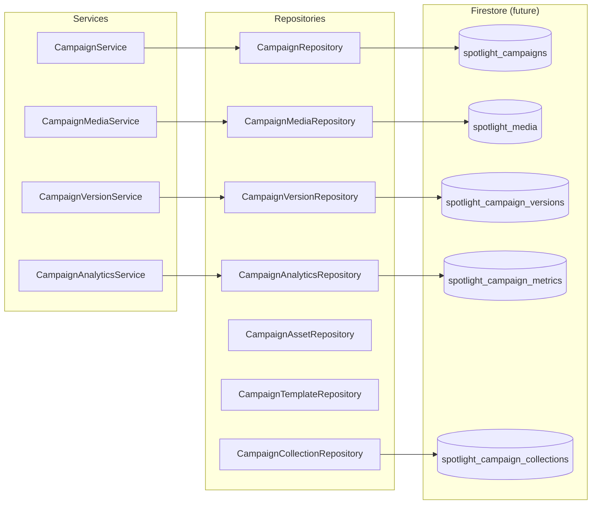

# Spotlight Repository Contracts

**Sprint:** LE-005.3.2 — Interfaces only, no Firestore implementation  
**Module:** `src/types/spotlight/repositories/`

---

## Repository Diagram



---

## Repository Inventory

| Repository | Methods | Firestore Collection |
|------------|---------|---------------------|
| `CampaignRepository` | create, update, delete, findById, findBySlug, list, search | `spotlight_campaigns` |
| `CampaignMediaRepository` | findById, findByCampaignId, save, delete, linkToCampaign | `spotlight_media` |
| `CampaignVersionRepository` | saveSnapshot, list, find | `spotlight_campaign_versions` |
| `CampaignAnalyticsRepository` | getMetrics, appendEvent | `spotlight_campaign_metrics` |
| `CampaignAssetRepository` | findByCampaignId, save, delete | inline or `spotlight_campaigns.assets[]` |
| `CampaignTemplateRepository` | list, findById, save | `spotlight_templates` |
| `CampaignCollectionRepository` | findById, listByParent, save, addCampaign, removeCampaign | `spotlight_campaign_collections` |

---

## Future Firestore Mapping

### `spotlight_campaigns/{campaignId}`

```typescript
// Document shape = SpotlightCampaign (+ optional CMS fields in admin views)
{
  campaignId, campaignName, campaignSlug, status,
  linkedProductIds, primaryProductId, media[],
  schedule, placementRules, seo?, localization?, targeting?,
  versioning?, audit?, campaignHealthScore?
}
```

### `spotlight_campaign_versions/{campaignId}/snapshots/{version}`

```typescript
// SpotlightCampaignVersionSnapshot
{ version, snapshotAt, snapshotBy, payload }
```

### `spotlight_campaign_metrics/{campaignId}/daily/{date}`

```typescript
{ impressions, views, clicks, conversions, revenue }
```

### Indexes (from `collections.ts`)

- `status` + `schedule.startAt` + `priority` DESC
- `campaignSlug`
- `linkedBrandIds` array-contains
- `primaryProductId`
- `objective`, `approvalStage`, `campaignHealthScore`

---

## Registry

```typescript
interface SpotlightRepositoryRegistry {
  campaigns: CampaignRepository;
  media: CampaignMediaRepository;
  versions: CampaignVersionRepository;
  analytics: CampaignAnalyticsRepository;
  assets: CampaignAssetRepository;
  templates: CampaignTemplateRepository;
  collections: CampaignCollectionRepository;
}
```

---

## Pagination

Repositories return `SpotlightPaginatedResponse<T>` with cursor-based pagination for scale (100k+ campaigns).

---

## Related Docs

- [SPOTLIGHT_ARCHITECTURE.md](./SPOTLIGHT_ARCHITECTURE.md)
- [SPOTLIGHT_SERVICES.md](./SPOTLIGHT_SERVICES.md)
