# Spotlight Service Contracts

**Sprint:** LE-005.3.2 — Interfaces only, no implementation  
**Module:** `src/types/spotlight/services/`

---

## Service Diagram

```mermaid
flowchart TB
  subgraph Client["Clients"]
    WEB[Choosify-Web]
    ADMIN[choosify-admin-4.0]
  end

  subgraph Registry["SpotlightServiceRegistry"]
    CS[CampaignService]
    PUB[CampaignPublishingService]
    SCH[CampaignSchedulingService]
    MED[CampaignMediaService]
    PRD[CampaignProductService]
    PLA[CampaignPlacementService]
    AST[CampaignAssetService]
    TPL[CampaignTemplateService]
    VER[CampaignVersionService]
    SEO[CampaignSeoService]
    LOC[CampaignLocalizationService]
    TGT[CampaignTargetingService]
    HLT[CampaignHealthService]
    ANA[CampaignAnalyticsService]
    MOD[CampaignModerationService]
    SRC[CampaignSearchService]
    REC[CampaignRecommendationService]
    AI[CampaignAiService]
  end

  subgraph Repos["Repositories (future)"]
    CR[CampaignRepository]
    MR[CampaignMediaRepository]
    VR[CampaignVersionRepository]
  end

  WEB --> Registry
  ADMIN --> Registry
  CS --> CR
  MED --> MR
  VER --> VR
  ANA --> ES008[ES-008 Analytics]
  MOD --> ES009[ES-009 Moderation]
  SRC --> ES010[ES-010 Discovery]
  REC --> ES010
  AI --> ES012[ES-012 Emi AI]
```



---

## Service Inventory

| Service | Responsibility |
|---------|----------------|
| `CampaignService` | CRUD, workflow (submit/approve/reject/archive/restore), list, search, preview |
| `CampaignPublishingService` | Publish / unpublish |
| `CampaignSchedulingService` | Schedule / cancel schedule |
| `CampaignMediaService` | Campaign media links, upload init/complete |
| `CampaignProductService` | Attach/detach/reorder catalog products |
| `CampaignPlacementService` | Surface assignment |
| `CampaignAssetService` | PDF, brochures, coupons, etc. |
| `CampaignTemplateService` | Reusable presets |
| `CampaignVersionService` | Version list, rollback |
| `CampaignSeoService` | SEO metadata CRUD |
| `CampaignLocalizationService` | Locale content CRUD |
| `CampaignTargetingService` | Audience targeting CRUD |
| `CampaignHealthService` | Health score read/recalculate |
| `CampaignAnalyticsService` | Metrics + event tracking |
| `CampaignModerationService` | Moderation workflow + history |
| `CampaignSearchService` | Full-text search + autocomplete |
| `CampaignRecommendationService` | User/related recommendations |
| `CampaignAiService` | AI generation + predictions |

---

## Dependency Injection

```typescript
interface SpotlightServiceRegistry {
  campaign: CampaignService;
  publishing: CampaignPublishingService;
  scheduling: CampaignSchedulingService;
  media: CampaignMediaService;
  products: CampaignProductService;
  placement: CampaignPlacementService;
  assets: CampaignAssetService;
  templates: CampaignTemplateService;
  versions: CampaignVersionService;
  seo: CampaignSeoService;
  localization: CampaignLocalizationService;
  targeting: CampaignTargetingService;
  health: CampaignHealthService;
  analytics: CampaignAnalyticsService;
  moderation: CampaignModerationService;
  search: CampaignSearchService;
  recommendation: CampaignRecommendationService;
  ai: CampaignAiService;
}
```

---

## Implementation Phases

| Phase | Services | Backend |
|-------|----------|---------|
| 1 | Campaign, Media, Products | Firestore CRUD |
| 2 | Publishing, Scheduling, Moderation | Cloud Functions |
| 3 | Analytics, Search, Discovery | ES-008, ES-010 |
| 4 | AI, Recommendation, Health | ES-012, ML workers |

---

## Local Prototype Mapping

Current `spotlightCampaignStorage.ts` implements a subset of `CampaignRepository` + `CampaignMediaService` via localStorage. Future HTTP client implements `SpotlightServiceRegistry` against `/api/v1/spotlight`.

---

## Related Docs

- [SPOTLIGHT_API.md](./SPOTLIGHT_API.md)
- [SPOTLIGHT_REPOSITORIES.md](./SPOTLIGHT_REPOSITORIES.md)
